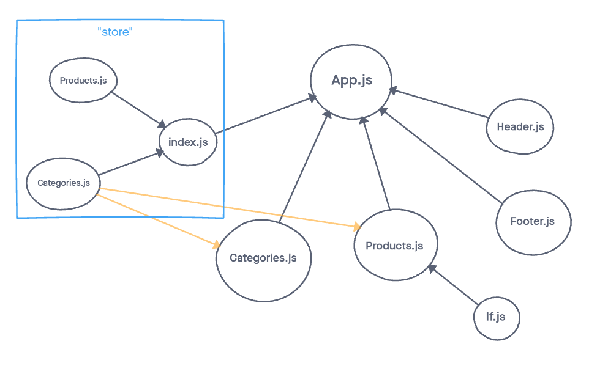

# Virtual Store

### Lab 36
Virtual Store Phase 1: For this assignment, you will be starting the process of creating an e-Commerce storefront using React with Redux, coupled with your live API server

## Overview

### Lab 36
Today, we begin the first of a 4-Phase build of the storefront application, written in React. In this first phase, our goal is to setup the basic scaffolding of the application with initial styling and basic behaviors. This initial build sets up the file structure and state management so that we can progressively build this application in a scalable manner

## Author: William Moreno

## Getting Started

The Virtual Store can be found here on Netlify:

[Virtual Store](https://hardcore-wright-bd2382.netlify.app/)

## Features

### Lab 36
- an `App` component that serves as the container for all sub-components of this application
- a <Header> component which shows the name of your virtual store
- a <Footer> component which shows your copyright and contact information
- a <Categories> component
  - shows a list of all categories
  - dispatches an action when one is clicked to “activate” it
- a <Products> component
  - displays a list of products associated with the selected category

## Process

### Lab 31
Repository created. Create-react-app used to create project folder. Folder loaded into repository. Basic scaffolding of project folder and installation of required dependencies. Basic Header and Footer created and attached. Redux store created (categories and index) and connected to app. Categories component created and integrated. Store expanded to include products.js and Products.js component created. If.js created as a helper and installed. All components then styled utilizing '@material-ui'.

App deployed on Netlify.

## UML

UML drawing created with [miro](https://miro.com/)

